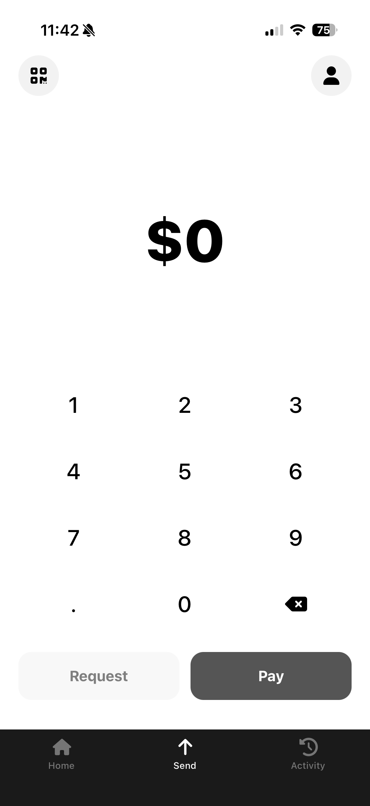
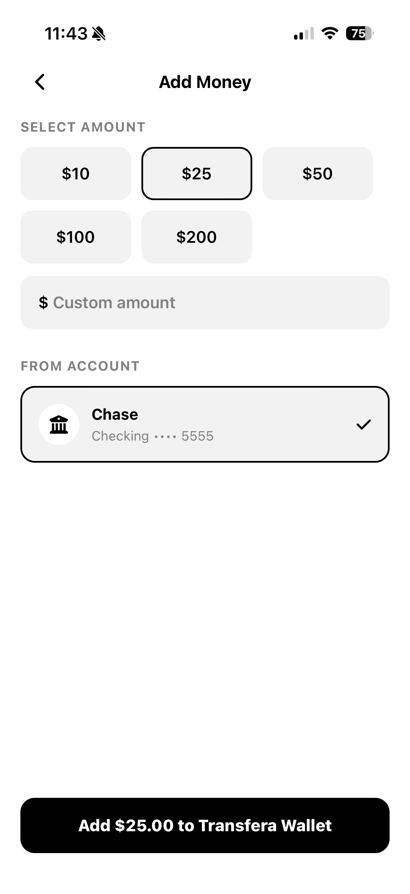
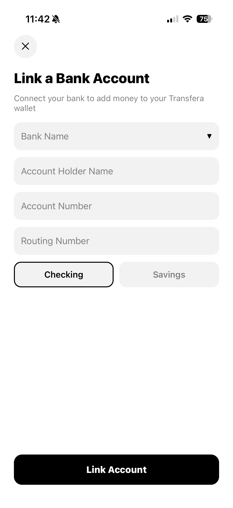
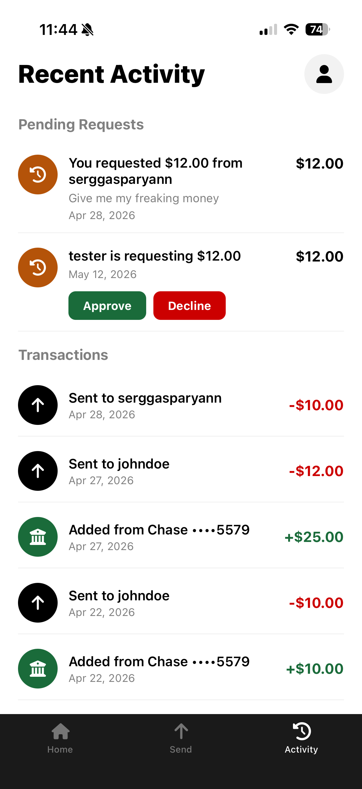
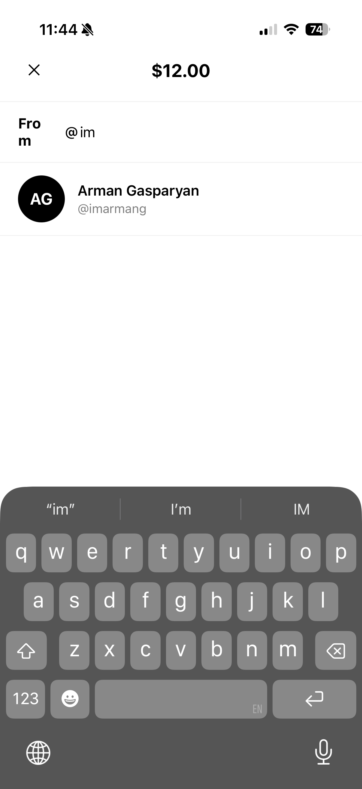
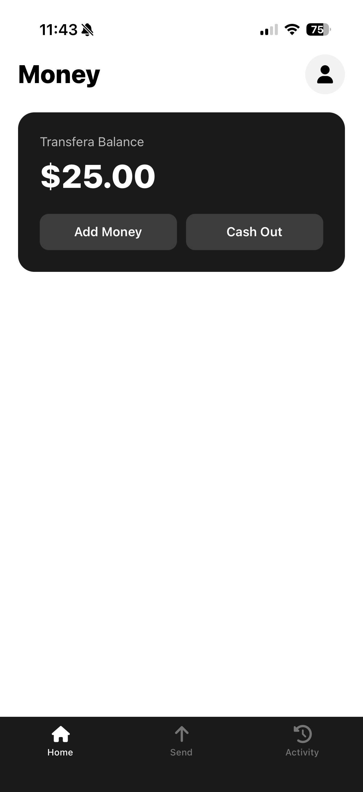

# Transfera


Transfera is a full-stack mobile payment application inspired by Venmo and Cash App. Users can create a wallet, link bank accounts, send and request money from other users, and view their complete transaction history in an activity feed.

## Demo
<div align="center">
  
</div>

## Screenshots
<div align="center">
  
  
  
  
  
    
</div>

## Table of Contents

- [Overview](#overview)
- [Requirements](#requirements)
- [Getting Started](#getting-started)
- [Available Commands](#available-commands)
- [Architecture](#architecture)
- [Transfera Backend](#transfera-backend)
    - [Command/Query Pattern](#commandquery-pattern)
    - [Authentication](#authentication)
    - [JWT Security](#jwt-security)
    - [Wallet System](#wallet-system)
    - [Send Money](#send-money)
    - [Money Request Lifecycle](#money-request-lifecycle)
    - [Activity Feed](#activity-feed)
    - [Password Reset](#password-reset)
    - [Error Handling](#error-handling)
- [Transfera Frontend](#transfera-frontend)
- [Database](#database)
- [API Reference](#api-reference)
- [Testing](#testing)
- [Known Limitations](#known-limitations)
- [What's Next](#whats-next)

---

## Overview

Transfera is a Capstone project demonstrating an end-to-end mobile fintech integration — from user registration and authentication through wallet funding, peer-to-peer transfers, and a real-time activity feed.

The backend is a **Spring Boot REST API** deployed on **AWS EC2** with a **PostgreSQL database on AWS RDS**. Every push to `main` automatically deploys via a **GitHub Actions CI/CD pipeline**. The mobile frontend is built with **React Native + Expo** and targets both iOS and Android.

---

## Requirements

- **Java** 17 or higher
- **PostgreSQL** 14 or higher
- **Node.js** 18 or higher
- **Expo CLI** — `npm install -g expo-cli`
- **Expo Go** app on your iOS or Android device, or an emulator/simulator

---

## Getting Started

> **Note:** Run backend and frontend in separate terminals.

### 1. Clone the repository

```bash
git clone https://github.com/yourusername/Transfera.git
cd Transfera
```

### 2. Configure the backend

```bash
cd backend
cp src/main/resources/application.properties.example \
   src/main/resources/application.properties
```

Open `application.properties` and fill in your credentials:

```properties
# Database
spring.datasource.url=jdbc:postgresql://localhost:5432/transfera
spring.datasource.username=your_db_username
spring.datasource.password=your_db_password

# JWT
jwt.secret=your_base64_encoded_secret

# Google OAuth2
google.client.id=your_google_client_id

# Gmail SMTP (for password reset emails)
spring.mail.username=your_gmail_address
spring.mail.password=your_gmail_app_password
app.mail.from=your_gmail_address
```

### 3. Create the database

```bash
createdb transfera
```

Spring Boot will auto-create tables on first run via Hibernate (`spring.jpa.hibernate.ddl-auto=update`).

### 4. Start the backend

```bash
./gradlew bootRun
```

The server starts on `http://localhost:8080`.

### 5. Install frontend dependencies

```bash
cd ../frontend
npm install
```

### 6. Start the frontend

```bash
npx expo start
```

- Scan the QR code with **Expo Go** on your device
- Press `i` to open in the iOS Simulator
- Press `a` to open in the Android Emulator

---

## Available Commands

### Backend

| Command | Description |
|---|---|
| `./gradlew bootRun` | Start the backend server |
| `./gradlew test` | Run all unit tests |
| `./gradlew build` | Build the project JAR |

### Frontend

| Command | Description |
|---|---|
| `npm install` | Install dependencies |
| `npx expo start` | Start the Expo development server |
| `npx expo run:ios` | Run on iOS Simulator |
| `npx expo run:android` | Run on Android Emulator |

---

## Architecture

Transfera is composed of three components: a React Native mobile client, a Spring Boot backend server, and a PostgreSQL database.

```
┌──────────────────────────────────────────┐
│           React Native / Expo            │
│           (iOS + Android)                │
└────────────────┬─────────────────────────┘
                 │  HTTPS / REST
                 ▼
┌──────────────────────────────────────────┐
│         Spring Boot Backend              │
│         AWS EC2 + Elastic IP             │
│                                          │
│  controller → service → repository       │
└────────────────┬─────────────────────────┘
                 │  Spring Data JPA / Hibernate
                 ▼
┌──────────────────────────────────────────┐
│         PostgreSQL (AWS RDS)             │
└──────────────────────────────────────────┘
```

### CI/CD Pipeline

Every push to `main` triggers a GitHub Actions workflow:

```
Push to main
  └─→ GitHub Actions
        ├─→ Run: ./gradlew test
        └─→ SSH into EC2
              ├─→ git pull
              └─→ Rebuild + restart Spring Boot
```

The EC2 instance uses an **Elastic IP** to keep the server address stable across reboots. The production `application.properties` file is stored on the server and is never committed to the repository.

---

## Transfera Backend

The backend is written in Java using Spring Boot. It connects to PostgreSQL via Spring Data JPA / Hibernate, handles authentication with Spring Security + JWT, and exposes a REST API consumed by the mobile client.

### Command/Query Pattern

Every use case in the backend is a dedicated service class implementing one of two interfaces:

```java
public interface Command<I, O> {
    ResponseEntity<O> execute(I input);
}

public interface Query<I, O> {
    ResponseEntity<O> execute(I input);
}
```

`Command` is used for operations that mutate state (send money, create a request, register a user). `Query` is used for read-only operations (get wallet, get transaction history, search profiles).

Each controller injects only the services it needs and delegates immediately — no business logic lives in controllers.

```java
@PostMapping("/send-money")
public ResponseEntity<TransferaWalletDTO> sendMoney(@RequestBody SendMoneyRequestDTO request) {
    return sendMoneyTransferaWalletService.execute(request);
}
```

This makes the codebase navigable by behavior: to understand how money
is sent, you open `SendMoneyTransferaWalletService`. To understand how
a wallet is created, you open `CreateTransferaWalletService`. There is
no `WalletService` with eight methods to scan through.
### Authentication

Transfera supports two authentication methods: local email/password and Google OAuth2.

**Local registration and login**

Registration creates a `UserCredentials` record with a BCrypt-hashed password and an `authProvider` of `LOCAL`, creates a `TransferaWallet` for the new user, and returns a JWT. The login endpoint authenticates via Spring Security's `AuthenticationManager` and returns a JWT on success.

**Google OAuth2**

The mobile client sends a Google ID token (obtained from the Expo Google Sign-In SDK) to `/auth2/google` or `/auth2/google/register`. The backend verifies the token using the Google API client library, extracts the email, and either logs the user in or creates a new account with `authProvider` set to `GOOGLE`. A JWT is issued in both cases.

Google users do not have a password column — `password` is nullable in the `app_user` table, and the `authProvider` field distinguishes local accounts from Google accounts.

```
POST /auth/register         → creates UserCredentials + Wallet, returns JWT
POST /auth/login            → authenticates, returns JWT
POST /auth2/google          → verifies Google token, returns JWT
POST /auth2/google/register → creates Google user + Wallet, returns JWT
POST /auth/logout           → blacklists the token
```

### JWT Security

Every request passes through `JwtAuthenticationFilter`, which:

1. Extracts the `Bearer` token from the `Authorization` header
2. Validates the token signature and expiry using `JwtUtil`
3. Checks the token against the blacklist in `TokenBlacklistService`
4. If valid, sets the authenticated principal in `SecurityContextHolder`

Tokens are valid for **24 hours**. The subject of the token is the user's email address, which is how services identify the authenticated user:

```java
String email = (String) SecurityContextHolder.getContext()
                        .getAuthentication().getPrincipal();
```

On logout, the full token string is added to an in-memory `ConcurrentHashSet` in `TokenBlacklistService` and rejected on all subsequent requests. See [Known Limitations](#known-limitations) for notes on this approach.

### Wallet System

A `TransferaWallet` is automatically created for every new user — both local and Google — at registration time. The wallet has:

- A UUID primary key
- A `walletNumber` — a randomly generated 10-digit string, unique across all wallets
- A `balance` stored as `BigDecimal` with scale 2 (i.e. `$0.00`)
- A `@Version` field for **optimistic locking**

The `@Version` field is key for concurrency safety. When two concurrent requests try to update the same wallet, Hibernate compares the version number at commit time. If it has changed since the row was read, it throws an `OptimisticLockException` rather than silently applying a lost update.

```java
@Version
@Column(name = "version")
private Long version;
```

### Send Money

`SendMoneyTransferaWalletService` handles direct peer-to-peer transfers. The entire operation runs inside a single `@Transactional` method:

1. Resolve the sender's wallet from their authenticated email
2. Resolve the recipient's wallet from the provided username
3. Guard against self-transfers
4. Guard against zero or negative amounts
5. Guard against insufficient balance
6. Subtract from sender's balance, add to recipient's balance
7. Save both wallets
8. Create a `SEND` transaction for the sender and a `RECEIVED` transaction for the recipient — both written as `COMPLETED` immediately

If anything fails at any step, the entire transaction rolls back and neither wallet is modified.

### Money Request Lifecycle

A money request is stored as a **single shared record** in the `money_request` table, visible to both parties. The `requester` column stores the username of whoever sent the request; the `requestee` column stores the username of whoever was asked to pay.

```
money_request
├── money_request_id  (UUID, PK)
├── requester         (username — sent the request)
├── requestee         (username — asked to pay)
├── requester_wallet_id
├── payer_wallet_id
├── amount
├── note
├── status            (PENDING | APPROVED | DECLINED)
└── created_at
```

**Creating a request** (`CreateMoneyRequestService`)

The requester provides a recipient username and an amount. The service resolves both wallets, guards against self-requests, and saves the record with status `PENDING`.

**Responding to a request** (`RespondToMoneyRequestService`)

The payer submits the `moneyRequestId` and a response of either `APPROVED` or `DECLINED`. The service:

1. Loads the `MoneyRequest` and verifies it is still `PENDING`
2. Verifies the authenticated user is the payer
3. If `APPROVED`:
    - Verifies the payer has sufficient balance
    - Subtracts from the payer's wallet, adds to the requester's wallet
    - Creates a `SEND` transaction (payer's history) and a `RECEIVED` transaction (requester's history), both with `moneyRequestId` set so they can be linked back to the request
    - Updates request status to `APPROVED`
4. If `DECLINED`:
    - No money moves and no `Transaction` record is created
    - The `MoneyRequest` status update to `DECLINED` is the only record of the event

```
PENDING ──→ APPROVED   (funds transferred, two COMPLETED transactions created)
        ──→ DECLINED   (no money moves, no transaction record created)
```

### Activity Feed

`GetTransactionsHistoryService` returns an `ActivityFeedDTO` containing two lists:

- **`pendingRequests`** — all `MoneyRequest` rows where the authenticated user is either the requester or the payer, filtered to `status = PENDING`. These are displayed as actionable items at the top of the activity screen.
- **`transactions`** — all `Transaction` rows for the authenticated user's wallet, sorted by `created_at` descending.

```java
public class ActivityFeedDTO {
    private List<MoneyRequestDTO> pendingRequests;
    private List<TransactionDTO> transactions;
}
```

Each `Transaction` record carries a `type` (`ADD_MONEY`, `CASH_OUT`, `SEND`, `RECEIVED`) and a `status` (`PENDING`, `COMPLETED`, `FAILED`, `DECLINED`). Transactions involving bank operations start as `PENDING`; peer-to-peer transactions are written as `COMPLETED` immediately since they resolve synchronously.

### Password Reset

Password reset uses a token-based deep link flow:

1. User submits their email to `POST /auth/forgot-password`
2. `ForgotPasswordService` generates a `PasswordResetToken` — a UUID token with a **10-minute expiry** — saves it to the `password_reset_tokens` table, and sends an email via Gmail SMTP containing:
   ```
   https://transfera-redirect-web.vercel.app?token=<token>
   ```
3. Clicking the link opens the Transfera app via a deep link (handled by a small redirect web app on Vercel)
4. The app extracts the token and lets the user set a new password
5. `POST /auth/reset-password` validates the token (not expired, not already used), BCrypt-hashes the new password, saves it, and marks the token as used

`PasswordResetToken` has a boolean `used` field and an `isExpired()` method:

```java
public boolean isExpired() {
    return LocalDateTime.now().isAfter(expiryDate); // 10 minutes from creation
}
```

### Error Handling

All exceptions are handled centrally in `GlobalExceptionHandler` (`@ControllerAdvice`), which maps each custom exception type to an HTTP status and a consistent `ErrorResponse` body:

| Exception | HTTP Status |
|---|---|
| `TransferaWalletNotFoundException` | 404 Not Found |
| `UserNotFound` | 404 Not Found |
| `LinkedBankAccountNotFoundException` | 404 Not Found |
| `InsufficientBalanceTransferaWalletException` | 422 Unprocessable Entity |
| `RequestMoneyFromYourself` | 422 Unprocessable Entity |
| `LinkedBankAccountExists` | 409 Conflict |
| `UsernameAlreadyTaken` | 409 Conflict |
| `ProfileAlreadyExists` | 409 Conflict |
| `GoogleAuthException` | 401 Unauthorized |
| `InvalidResetTokenException` | 401 Unauthorized |
| `FeatureNotImplemented` | 501 Not Implemented |

---

## Transfera Frontend

The mobile client is written in **TypeScript** using **React Native** and **Expo**. Navigation is handled by **Expo Router**, which uses a file-based routing system similar to Next.js.

**Key concepts**

- **Auth state** — JWT tokens are persisted in `SecureStore` (Expo's encrypted key-value store). An Axios interceptor attaches the token to every outgoing request automatically.
- **Google Sign-In** — implemented using the Expo Google Sign-In SDK. On successful sign-in, the Google ID token is sent to the backend for verification rather than trusting the client.
- **Screens** — organized by feature under the `app/` directory using Expo Router's file-based conventions.

**Main screens**

| Screen | Description |
|---|---|
| Home | Wallet balance, quick-action buttons (Add, Send, Request, Cash Out) |
| Activity | Pending money requests + full transaction history |
| Send | Search for a user by username, enter amount and note |
| Request | Search for a user by username, enter amount and note |
| Add Money | Select a linked bank account, enter an amount |
| Cash Out | Select a linked bank account, enter an amount |
| Linked Bank Accounts | View and add bank accounts (checking/savings) |
| Profile | Display name, username, phone number |

---

## Database

The database is a PostgreSQL instance. Connect using:

```bash
psql -U postgres -d transfera
```

Tables are managed by Hibernate and created automatically on startup.

**Core tables**

| Table | Description |
|---|---|
| `app_user` | Email, BCrypt password, and auth provider (`LOCAL` or `GOOGLE`) |
| `profile` | Username, first name, last name, phone number — linked to `app_user` |
| `transfera_wallet` | Wallet number, balance, optimistic lock version — linked to `app_user` |
| `linked_bank_account` | Bank name, account/routing number, account type — linked to `app_user` |
| `transaction` | Amount, type, status, peer name, optional bank account reference, optional money request reference |
| `money_request` | Requester/requestee usernames + wallets, amount, note, status |
| `password_reset_tokens` | UUID token, expiry (10 min), used flag — linked to `app_user` |

**Key relationships**

- `app_user` ←→ `profile` (one-to-one)
- `app_user` ←→ `transfera_wallet` (one-to-one)
- `app_user` → `linked_bank_account` (one-to-many)
- `transfera_wallet` → `transaction` (one-to-many)
- `transfera_wallet` ←→ `money_request` as requester and payer (many-to-one each)

---

## API Reference

All endpoints under `/api/v1/` require a valid JWT in the `Authorization: Bearer <token>` header.

### Auth — `/auth`

| Method | Endpoint | Description |
|---|---|---|
| `POST` | `/auth/register` | Register with email and password |
| `POST` | `/auth/login` | Log in, receive JWT |
| `POST` | `/auth/logout` | Blacklist the current token |
| `POST` | `/auth/forgot-password` | Send password reset email |
| `POST` | `/auth/reset-password` | Reset password with token from email |
| `POST` | `/auth2/google` | Sign in with Google |
| `POST` | `/auth2/google/register` | Register with Google |

### Wallet — `/api/v1/transfera-wallet`

| Method | Endpoint | Description |
|---|---|---|
| `GET` | `/api/v1/transfera-wallet` | Get wallet balance and wallet number |
| `POST` | `/api/v1/transfera-wallet/add-money` | Add money from a linked bank account |
| `POST` | `/api/v1/transfera-wallet/send-money` | Send money to another user |
| `POST` | `/api/v1/transfera-wallet/cash-out` | Withdraw balance to a linked bank account |

### Transactions — `/api/v1/transaction`

| Method | Endpoint | Description |
|---|---|---|
| `GET` | `/api/v1/transaction/history` | Get activity feed (pending requests + transaction history) |
| `POST` | `/api/v1/transaction/request` | Create a money request |
| `POST` | `/api/v1/transaction/request/respond` | Approve or decline a money request |

### Linked Bank Accounts — `/api/v1/linked-bank-account`

| Method | Endpoint | Description |
|---|---|---|
| `GET` | `/api/v1/linked-bank-account` | Get all linked bank accounts |
| `POST` | `/api/v1/linked-bank-account` | Link a new bank account |
| `DELETE` | `/api/v1/linked-bank-account/{id}` | Delete a linked bank account *(not yet implemented)* |

### Profile — `/api/v1/profile`

| Method | Endpoint | Description |
|---|---|---|
| `POST` | `/api/v1/profile` | Create a profile (after registration) |
| `GET` | `/api/v1/profile` | Get the authenticated user's profile |
| `GET` | `/api/v1/profile/search?username=` | Search for a user by username |

---

## Testing

```bash
cd backend
./gradlew test
```

Tests are written with **JUnit 5** and **Mockito** using `@ExtendWith(MockitoExtension.class)`. Each test class uses `@InjectMocks` on the service under test and `@Mock` for its dependencies. The `SecurityContextHolder` is populated in `@BeforeEach` to simulate an authenticated user.

**Coverage**

| Test Class | What it covers |
|---|---|
| `AddMoneyTransferaWalletServiceTest` | Happy path, missing bank account, missing wallet |
| `SendMoneyTransferaWalletServiceTest` | Happy path, insufficient balance, self-send guard, concurrent requests |
| `CashOutTransferaWalletServiceTest` | Happy path, insufficient balance, missing bank account |
| `CreateMoneyRequestServiceTest` | Happy path, self-request guard, user not found |
| `RespondToMoneyRequestServiceTest` | Approve path, decline path, already-responded guard |
| `GetTransactionsHistoryServiceTest` | Returns correct transactions and pending requests |
| `SearchProfileServiceTest` | Happy path, user not found |

**Concurrency test example** — `SendMoneyTransferaWalletServiceTest` includes a test that fires 10 concurrent send requests from the same sender wallet using an `ExecutorService` and verifies that the final balance is consistent with the number of successful transfers.

---

## Known Limitations

**Token blacklist is in-memory**

`TokenBlacklistService` stores blacklisted tokens in a `ConcurrentHashSet`. This works for a single-server deployment but has several production limitations the codebase acknowledges with a `// TODO`:

- The set grows indefinitely — blacklisted tokens are never cleaned up
- It resets if the server restarts — previously revoked tokens become valid again
- It does not work across multiple server instances without a shared store

The intended production fix is to store only the token's `jti` claim in Redis with a TTL matching the token expiry, rather than storing the full token string.

**Linked bank account deletion not implemented**

The `DELETE /api/v1/linked-bank-account/{id}` endpoint exists in `LinkedBankAccountController` but returns `null`. The `DeleteLinkedBankAccountService` class exists in the service layer but is not yet wired to the controller.

**Bank transfers are simulated**

`ADD_MONEY` and `CASH_OUT` operations update the wallet balance immediately without connecting to a real banking API. Transactions are created with status `PENDING` to reflect that a real integration would involve an asynchronous transfer. Plaid integration is planned for a future release.

---

## What's Next

- **AI Spending Insights** — natural language summaries of transaction
  patterns using the Claude API ("You sent money to the same person
  6 times this month")
- **Push notifications** — real-time alerts via Expo Notifications when
  a transfer is received or a money request arrives
- **Declined requests in activity feed** — surface declined money requests
  in transaction history using the existing `TransactionFactory.requestDeclined()`
  hook
- **Redis-backed token blacklist** — replace the in-memory set with
  Redis + TTL for production-ready logout
- **Delete linked bank account** — wire `DeleteLinkedBankAccountService`
  to the existing `DELETE /api/v1/linked-bank-account/{id}` endpoint
- 
## License

[MIT](./LICENSE)